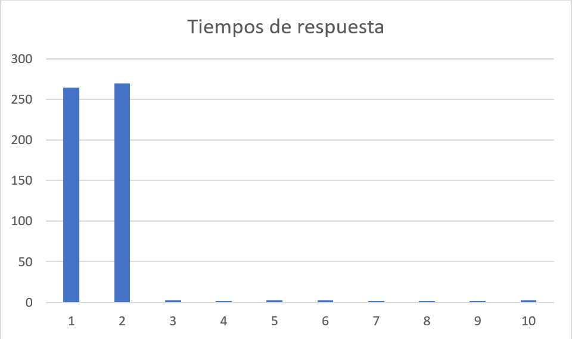
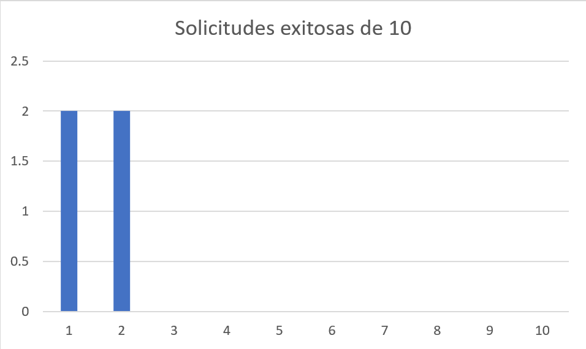

### Informe de peticiones

Al hacer 10 peticiones con newman de manera concurrente se obtuvieron los siguientes
resultados.

Los tiempos de respuesta de las primeras peticiones fueron los más altos, pero
esto a expensas de una baja cantidad de solicitudes respondidas debido a capacidades
del servidor y de la red.

  

Las primeras solicitudes obtuvieron 2 solicitudes respondidas de 10 enviadas, mientras que
las otras 8 obtuvieron 0.

Ciertos errores se obtuvieron debido a errores con código 502 y 403.